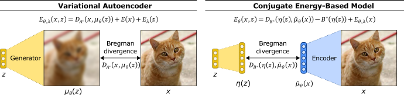

# Conjugate Energy-Based Models
Official Code for the paper Conjugate Energy-Based Models



## Usage

`main.py` is the main  file in order to run all the experiments and evaluations. Run `python main.py -h` to see more details.
The full set of experiments can be found in `script.sh`

### Training

```
### Example

# training + eval
python cebm/main.py --train --eval --seed=0 --device=1 --exp-id=test --data=mnist --lr=1e-3 --model=VAE --net=cnn --num-latent=128  --channels=[32,32,64,64] --kernels=[4,4,4,4] --strides=[2,2,2,2] --paddings=[3,1,1,1] --num-neurons=[128] --epochs=20

# load + eval
python cebm/main.py --load --eval --seed=0 --device=1 --exp-id=test --data=mnist --lr=1e-3 --model=VAE --net=cnn --num-latent=128  --channels=[32,32,64,64] --kernels=[4,4,4,4] --strides=[2,2,2,2] --paddings=[3,1,1,1] --num-neurons=[128] --epochs=20
```


# Acknowledgement

We found the following repositories helpful in our implementation:

https://github.com/wgrathwohl/JEM

https://github.com/point0bar1/ebm-anatomy

https://github.com/openai/ebm_code_release
